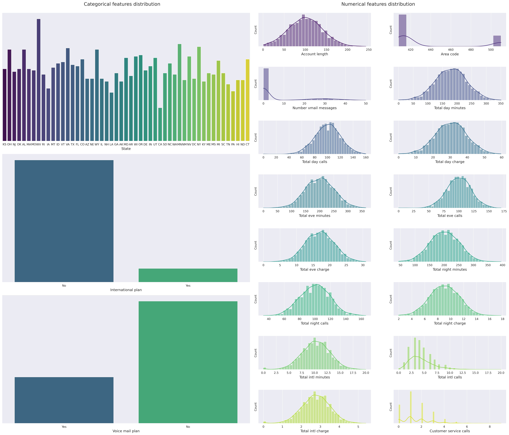
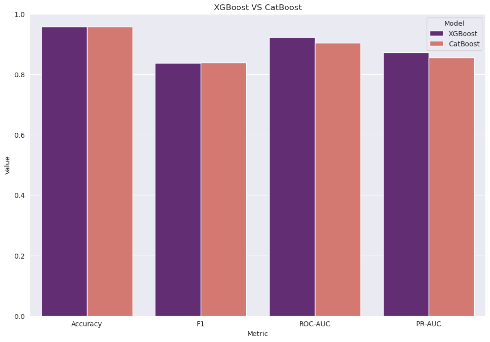
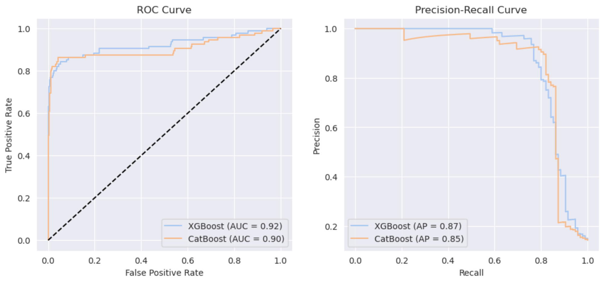

# Churn prediction

## Описание

Целью проекта было создание модели машинного обучения, которая на основе клиентских данных предсказывает вероятность оттока (прекращения использования услуг телекоммуникационной компании).  

На базе модели градиентного бустинга и backend-фреймворка **FastAPI** разработан сервис с удобным интерфейсом. Сотрудники могут загружать CSV-файл с данными о клиентах и получать для каждого клиента:

* предсказание оттока (да/нет);
* вероятность оттока (число от 0 до 1).

Также можно скачать обновленный CSV с результатами.

### Практическая ценность
- **Сотрудникам** — возможность быстро выявлять клиентов с высоким риском ухода.  
- **Компании** — сохранение клиентской базы за счёт своевременной коммуникации и персонализированных предложений, что напрямую способствует увеличению прибыли.
  
## Данные

Датасет для обучения представляет собой CSV-файл на 2666 строк, каждая из которых описывает одного клиента с помощью следующих признаков:

| Признак                   | Описание                                                      |
|----------------------------|---------------------------------------------------------------|
| State                      | Штат проживания клиента                                        |
| Account length             | Количество дней пользования услугами                           |
| Area code                  | Телефонный код региона                                         |
| International plan         | Наличие международного тарифа (yes/no)                         |
| Voice mail plan            | Наличие голосовой почты (yes/no)                               |
| Number vmail messages      | Количество голосовых сообщений                                  |
| Total day minutes          | Общее время звонков днём (в минутах)                           |
| Total day calls            | Количество звонков днём                                        |
| Total day charge           | Стоимость звонков днём                                         |
| Total eve minutes          | Общее время звонков вечером                                    |
| Total eve calls            | Количество звонков вечером                                     |
| Total eve charge           | Стоимость звонков вечером                                      |
| Total night minutes        | Общее время звонков ночью                                      |
| Total night calls          | Количество звонков ночью                                       |
| Total night charge         | Стоимость звонков ночью                                        |
| Total intl minutes         | Общее время международных звонков                               |
| Total intl calls           | Количество международных звонков                                 |
| Total intl charge          | Стоимость международных звонков                                  |
| Customer service calls     | Количество обращений в службу поддержки                         |
| Churn                      | Целевая переменная: ушёл ли клиент (yes/no)                     |

## Анализ и предобработка

Перед передачей в модель данные были проанализированы и обработаны.

### Распределения

Были построены графики распределений числовых и категориальных признаков. 

Анализ распределений позволил заключить, что существенных выбросов данные не имеют, а большинство численных признаков распределены по Гауссу, что поддталкивает к использованию StandardScaler для масштабирования. 

Категориальный признак State имеет много уникальных значений, из-за чего он кодировался с помощью TargetEncoder, остальные категориальные признаки бинарны, поэтому для них был выбран OneHotEncoder.

### Корреляции

Корреляционный анализ позволил выявить линейно зависимые признаки. Удаление таких признаков позволило:
- снизить риск переобучения модели;
- сократить признаковое пространство;
- сэкономить вычислительные ресурсы.

После признаки были проверены на величину корреляции с таргетом: максимальная корреляция — чуть больше 0.25, что несущественно.

## Модели

Для достижения лучшего результата было выбрано 6 моделей: Logistic Regression, Random Forest, K-Nearest Neighbors, Support Vector Machine, Gradient Boosting (XGBoost), Gradient Boosting (CatBoost). Такой набор моделей, включающий линейные алгоритмы, метрические алгоритмы и алгоритмы на деревьях, позволяет подойти к задаче с разных сторон и выбрать наилучший алгоритм.

С помощью кросс-валидации из моделей были выбраны два фаворита — градиентные бустинги, справившиеся с задачей практически одинаково. Для финального предсказания была выбрана модель XGBoost.

## Результаты и метрики

| Метрика   | Значение    |
|----------|----------|
| Accuracy | 0.958021 |
| F1       | 0.837209 |
| ROC-AUC  | 0.922782 |
| PR-AUC   | 0.872475 |

- **Accuracy ≈ 0.96**: модель показывает высокую точность , что отражает правильное предсказание большинства случаев, но из-за дисбаланса классов (клиентов, ушедших меньше, чем оставшихся) Accuracy может быть вводящей в заблуждение.
- **F1 ≈ 0.84**: модель учитывает баланс между точностью и полнотой для класса оттока.
- **ROC-AUC ≈ 0.92**: модель демонстрирует хорошую способность модели различать уходящих и оставшихся клиентов.
- **PR-AUC ≈ 0.87**: особенно важна здесь, так как класс «Churn» менее представлен, и эта метрика оценивает точность и полноту именно для редкого класса, показывая, что модель надёжно идентифицирует уходящих клиентов.

### Пример использования

